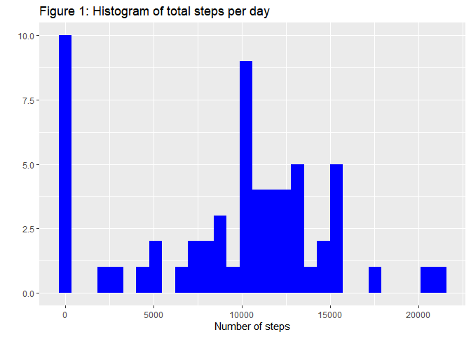

## Required packages
This analysis makes use of the `tidyverse` packages, as well as the 'lubridate' date manipulation tools.

```r
library(tidyverse)
library(lubridate)
```


## Loading and preprocessing the data
The data is loaded directly from activity.zip into a 17568 x 3 tibble.

```r
activity_data <- read_csv("activity.zip")
activity_data
```

```
## # A tibble: 17,568 × 3
##    steps date       interval
##    <dbl> <date>        <dbl>
##  1    NA 2012-10-01        0
##  2    NA 2012-10-01        5
##  3    NA 2012-10-01       10
##  4    NA 2012-10-01       15
##  5    NA 2012-10-01       20
##  6    NA 2012-10-01       25
##  7    NA 2012-10-01       30
##  8    NA 2012-10-01       35
##  9    NA 2012-10-01       40
## 10    NA 2012-10-01       45
## # … with 17,558 more rows
```
The columns are correctly formatted by `readr`'s default type interpretation.


## What is mean total number of steps taken per day?
We can first summarize the data in terms of the total number of steps recorded for each day.

```r
daily_steps <- activity_data %>%
    group_by(date) %>% summarize(steps = sum(steps, na.rm = TRUE))
qplot(daily_steps$steps, fill = I("blue"), bins = 30, 
      main = "Figure 1: Histogram of total steps per day", 
      xlab = "Number of steps")
```

<!-- -->

The median number of steps recorded per day is 10,395, while the mean is 9,354.23.


## What is the average daily activity pattern?


## Imputing missing values


## Are there differences in activity patterns between weekdays and weekends?
