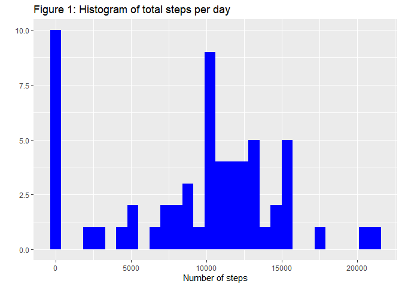
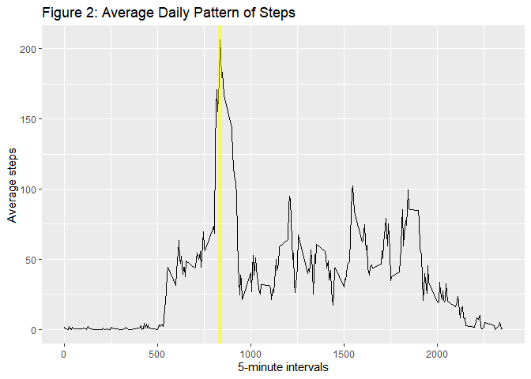
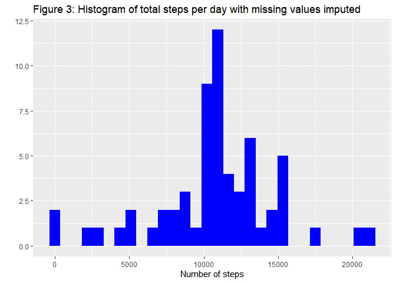
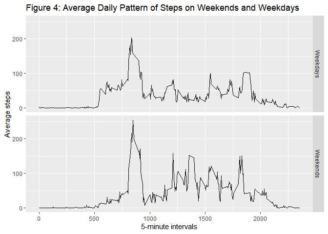

## Required packages
This analysis makes use of the `tidyverse` packages, as well as the `lubridate` date manipulation tools and `xtable` for html table formatting.

```r
library(tidyverse)
library(lubridate)
library(xtable)
```


## Loading and preprocessing the data
The data is loaded directly from `activity.zip` into a 17568 x 3 tibble.

```r
activity_data <- read_csv("activity.zip")
activity_data
```

```
## # A tibble: 17,568 × 3
##    steps date       interval
##    <dbl> <date>        <dbl>
##  1    NA 2012-10-01        0
##  2    NA 2012-10-01        5
##  3    NA 2012-10-01       10
##  4    NA 2012-10-01       15
##  5    NA 2012-10-01       20
##  6    NA 2012-10-01       25
##  7    NA 2012-10-01       30
##  8    NA 2012-10-01       35
##  9    NA 2012-10-01       40
## 10    NA 2012-10-01       45
## # … with 17,558 more rows
```
The columns are correctly formatted by `readr`'s default type interpretation.


## What is mean total number of steps taken per day?
We can first summarize the data in terms of the total number of steps recorded for each day.

```r
daily_steps <- activity_data %>%
    group_by(date) %>% summarize(steps = sum(steps, na.rm = TRUE))
qplot(daily_steps$steps, fill = I("blue"), bins = 30, 
      main = "Figure 1: Histogram of total steps per day", 
      xlab = "Number of steps")
```

<!-- -->

The median and mean of the daily steps per day are:

```r
summarize(daily_steps, Mean=mean(steps), Median=median(steps)) %>% 
    xtable(digits=c(0,2,0)) %>% print(type = "html")
```

<!-- html table generated in R 4.2.1 by xtable 1.8-4 package -->
<!-- Fri Jul 22 12:49:06 2022 -->
<table border=1>
<tr> <th>  </th> <th> Mean </th> <th> Median </th>  </tr>
  <tr> <td align="right"> 1 </td> <td align="right"> 9354.23 </td> <td align="right"> 10395 </td> </tr>
   </table>


## What is the average daily activity pattern?
By re-grouping the original data by 5-minute interval and averages the daily observations, we can see the average pattern of number of steps at different times of day.

```r
daily_pattern <- activity_data %>%
    group_by(interval) %>% summarize(steps = mean(steps, na.rm = TRUE))
ggplot(daily_pattern, aes(interval, steps)) +
    geom_line() +
    geom_vline(xintercept = filter(daily_pattern, steps == max(steps))$interval, color = "yellow", alpha = 0.5, size = 2) +
    labs(y = "Average steps", 
         x = "5-minute intervals", 
         title = "Figure 2: Average Daily Pattern of Steps")
```

<!-- -->

The vertical lines shows the interval of the maximum average number of steps.

```r
daily_pattern %>% filter(steps == max(steps))
```

```
## # A tibble: 1 × 2
##   interval steps
##      <dbl> <dbl>
## 1      835  206.
```


## Imputing missing values
A substantial number of observations, 2304 (or 13.11% on date-interval pairs), are missing. These missing observation are clustered in eight specific dates:

```r
activity_data %>% group_by(date) %>% summarize("Share missing" = mean(is.na(steps))) %>% filter(`Share missing` > 0)
```

```
## # A tibble: 8 × 2
##   date       `Share missing`
##   <date>               <dbl>
## 1 2012-10-01               1
## 2 2012-10-08               1
## 3 2012-11-01               1
## 4 2012-11-04               1
## 5 2012-11-09               1
## 6 2012-11-10               1
## 7 2012-11-14               1
## 8 2012-11-30               1
```

As such, other observations from a given day cannot be used to impute missing values. A simple alternative strategy would be to use the average number of steps in a given interval.

```r
activity_imputed <- activity_data %>% group_by(interval) %>% 
    mutate(steps = if_else(is.na(steps), mean(steps, na.rm = TRUE), steps))
```

We can then recompute the daily totals of steps with the imputed data.

```r
daily_imputed <- activity_imputed %>%
    group_by(date) %>% summarize(steps = sum(steps, na.rm = TRUE))
qplot(daily_imputed$steps, fill = I("blue"), bins = 30, 
      main = "Figure 3: Histogram of total steps per day with missing values imputed",
      xlab = "Number of steps")
```

<!-- -->

What we see is that the substantial number of days with 0 recorded steps reported in figure 1 above was the result of the days lacking any valid observations. This is also reflected in a higher mean (10766.19) and median (10766.19) daily steps, once missing values are imputed.


## Are there differences in activity patterns between weekdays and weekends?

Finally, we can compare the average daily patterns of steps between weekdays and weekends.

```r
weekday_pattern <- activity_imputed %>% 
    mutate(weekend = factor(if_else(wday(date) %in% 6:7, "Weekends", "Weekdays"))) %>%
    group_by(weekend, interval) %>% summarize(steps = mean(steps))
ggplot(weekday_pattern, aes(interval, steps)) +
    facet_grid(weekend ~ .) +
    geom_line() +
    labs(y = "Average steps", 
         x = "5-minute intervals", 
         title = "Figure 4: Average Daily Pattern of Steps on Weekends and Weekdays")
```

<!-- -->


